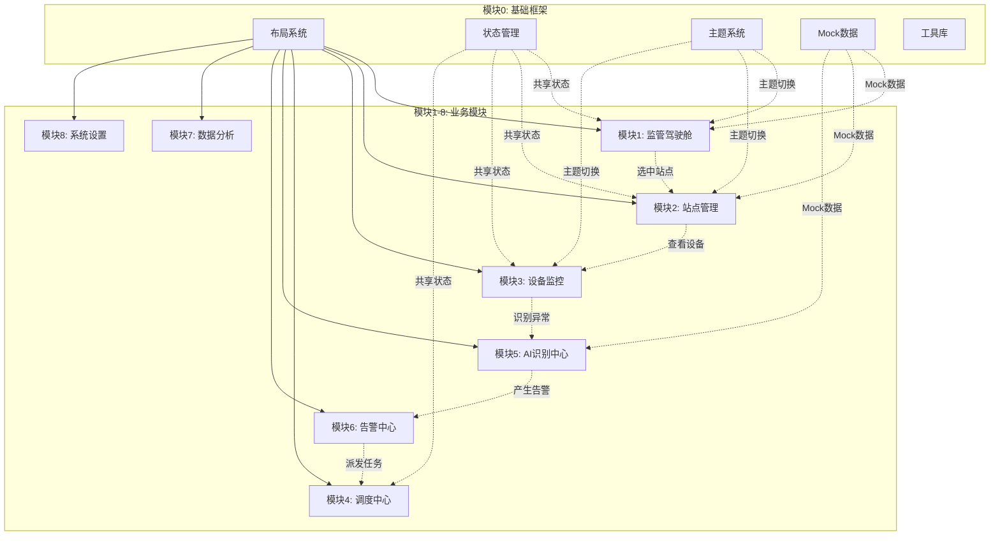

# 智环卫士 - 智慧垃圾站运营平台架构文档

> 模块0: 基础框架 | 版本: 1.0.0 | 最后更新: 2026-03-02

## 1. 系统架构



## 2. 模块划分说明

### 模块0: 基础框架 (已冻结)
负责系统基础能力，所有业务模块必须依赖此模块。

| 子系统 | 职责 | 导出路径 |
|-------|------|---------|
| 布局系统 | 提供统一的页面布局 | `@/components/layout/*` |
| 状态管理 | 全局状态管理(Zustand) | `@/store/*` |
| 主题系统 | 主题切换、CSS变量 | `@/hooks/useTheme`, `@/styles/theme.css` |
| Mock数据 | 模拟数据生成器 | `@/lib/mockGenerators` |
| 工具库 | 通用工具函数 | `@/lib/utils`, `@/lib/constants` |
| 类型定义 | 所有TypeScript类型 | `@/types/*` |
| 契约文档 | 模块连接契约 | `@/lib/CONTRACT.ts` |

### 模块1: 监管驾驶舱
- **功能**: 数据总览、实时KPI、快捷入口
- **依赖**: 模块0
- **路径**: `src/app/dashboard/page.tsx`

### 模块2: 站点管理
- **功能**: 站点列表、站点详情、GIS地图
- **依赖**: 模块0
- **路径**: `src/app/stations/page.tsx`

### 模块3: 设备监控
- **功能**: 设备列表、实时监控、远程控制
- **依赖**: 模块0
- **路径**: `src/app/monitor/page.tsx`

### 模块4: 调度中心
- **功能**: 任务调度、车辆管理、路线规划
- **依赖**: 模块0
- **路径**: `src/app/dispatch/page.tsx`

### 模块5: AI识别中心
- **功能**: 图像识别、行为分析、预警推送
- **依赖**: 模块0
- **路径**: `src/app/ai-center/page.tsx`

### 模块6: 告警中心
- **功能**: 告警列表、告警处理、历史查询
- **依赖**: 模块0
- **路径**: `src/app/alerts/page.tsx`

### 模块7: 数据分析
- **功能**: 统计报表、趋势分析、数据导出
- **依赖**: 模块0
- **路径**: `src/app/analytics/page.tsx`

### 模块8: 系统设置
- **功能**: 系统配置、用户管理、权限设置
- **依赖**: 模块0
- **路径**: `src/app/settings/page.tsx`

## 3. 模块间连接方式

### 3.1 路由连接
所有模块通过 Next.js App Router 进行页面级路由跳转。

```typescript
// 路由配置示例
const routes = [
  { path: '/dashboard', label: '驾驶舱' },
  { path: '/stations', label: '站点管理' },
  { path: '/monitor', label: '设备监控' },
  // ...
];
```

### 3.2 状态连接
通过 Zustand Store 进行跨模块状态共享。

| 状态 | Store | 用途 |
|-----|-------|-----|
| selectedStationId | useGlobalStore | 选中站点联动 |
| globalTimeRange | useGlobalStore | 时间范围同步 |
| alerts | useMockDataStore | 告警数据共享 |
| stations | useMockDataStore | 站点数据共享 |

### 3.3 事件连接
使用自定义事件进行松耦合通信。

```typescript
// 事件总线（预留）
interface AppEvents {
  'station:selected': { stationId: string };
  'alert:created': { alertId: string };
  'timeRange:changed': { start: Date; end: Date };
}
```

## 4. 文件组织规范

### 4.1 目录结构
```
src/
├── app/                    # Next.js App Router
│   ├── (auth)/            # 认证路由组
│   ├── dashboard/         # 驾驶舱模块
│   ├── stations/          # 站点管理模块
│   ├── monitor/           # 设备监控模块
│   ├── dispatch/          # 调度中心模块
│   ├── ai-center/         # AI识别模块
│   ├── alerts/            # 告警中心模块
│   ├── analytics/         # 数据分析模块
│   └── settings/          # 系统设置模块
├── components/
│   ├── ui/                # shadcn基础组件
│   ├── business/          # 业务组件（模块0提供）
│   └── layout/            # 布局组件（模块0提供）
├── hooks/                 # 自定义Hooks
├── lib/                   # 工具函数
│   ├── utils.ts           # 通用工具
│   ├── constants.ts       # 常量配置
│   ├── mockGenerators.ts  # Mock数据
│   └── CONTRACT.ts        # 契约文档
├── store/                 # Zustand状态
├── types/                 # TypeScript类型
└── styles/                # 样式文件
```

### 4.2 命名规范
- 组件: PascalCase (`StatCard.tsx`)
- Hooks: camelCase with `use` prefix (`useTheme.ts`)
- 工具: camelCase (`utils.ts`)
- 类型: PascalCase (`Station`, `AlertType`)
- 常量: UPPER_SNAKE_CASE

### 4.3 导入规范
```typescript
// ✅ 推荐：按功能分组导入
import { useTheme, useMockData } from '@/hooks';
import { StatCard, StatusTag } from '@/components/business';
import type { Station, Alert } from '@/types';

// ❌ 禁止：从模块0以外的路径导入类型
import type { Station } from '../../types'; // 相对路径
```

## 5. 技术栈

| 类别 | 技术 | 版本 |
|-----|------|-----|
| 框架 | Next.js | ^14.0.0 |
| 语言 | TypeScript | ^5.0.0 |
| 样式 | Tailwind CSS | ^3.4.0 |
| UI组件 | shadcn/ui | latest |
| 状态 | Zustand | ^4.5.0 |
| 动画 | Framer Motion | ^11.0.0 |
| 图表 | Recharts | ^2.12.0 |
| 图标 | Lucide React | ^0.344.0 |

## 6. 开发约定

### 6.1 组件编写
- 所有组件使用函数式组件
- Props必须有明确的类型定义
- 禁止使用 `any`
- 导出方式：`export function ComponentName`

### 6.2 状态管理
- 全局状态使用 Zustand
- 本地状态使用 useState
- 异步状态使用 useSWR 或 React Query（后续引入）

### 6.3 样式编写
- 使用 Tailwind CSS 类名
- 禁止内联样式
- 主题颜色使用 CSS 变量
- 自定义样式写入 `styles/theme.css`

## 7. 版本控制

| 版本 | 日期 | 变更内容 |
|-----|------|---------|
| 1.0.0 | 2026-03-02 | 初始版本，模块0基础框架完成 |
